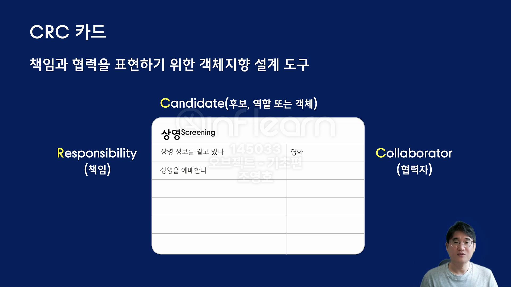

# object-study
조영호님의 오브젝트를 학습하기 위해 만든 repository

# 단어 사전
- 협력 
  - 기능을 구현하기 위해 객체간 상호작용 하는 것.
  - 자신에게 할당된 책임을 수행함으로써 다른 객체와 협력하게 된다.

- 책임 : 객체가 다른 객체와 협력하기 위해 알아야 하거나 행동해야 하는 것.
- 역할 : 협력 안에서 책임을 수행하는 대상. 추상화된 인터페스일수도 , 객체일수도 있다.

# 학습 메모

## 설계를 하는 이유
- 수정하기 쉬운 코드를 작성하기 위해 좋은 설계가 필요하다.
- 설계는 트레이드 오프 과정이다.

### 변경하기 쉬운 코드를 위한 객체지향 설계 원칙
- 협력에 필요한 행동을 먼저 결정하고, 행동에 적합한 객체를 나중에 선택하라.
- 행동을 먼저 구현하고, 행동에 필요한 데이터를 나중에 선택하라.
- 객체 지향 설계는 협력에 필요한 행동을 먼저 결정하고 행동에 필요한 객체, 데이터를 나중에 선택하면 좀 더 유연한 설계를 할 수 있다.

## 책임 주도 설계
- 기능을 구현할 때 책임을 결정한 후에 책임을 수행할 객체를 결정하는 설계 방법.
- 객체에게 무엇을 요청할 것인가 ? 
- 객체는 어떤 책임을 져야 하는가 ?

## 추상화
- 우리에게 필요에 맞는 부분을 취하고 필요없는 부분을 버려 단순화 시킨 것.
- 일종의 단순화라고 볼 수 있다.
- 추상화로 객체 협력 패턴을 고정시킬 수 있다. 다형성을 구현하여, 세부 구현을 확장 가능하다 ! 

## 표현적 차이
- 도메인 모델과 객체지향 모델의 구조가 비슷하다면 표현적 차이가 적다고 말할 수 있다.
- 표현적 차이를 줄이기 위해서는 객체가 도메인 요구사항을 잘 서술하면 된다.

## CRC 카드
- 책임과 협력을 표현하기 위한 객체지향 설계 도구이다.
- 

### GRASP

- Information expert 정보 전문가
  - 책임을 객체에게 할당하는 일반적인 원칙은 ?
  - -> 책임을 수행하는데 필요한 정보를 가장 많이 알고 있는 객체에게 할당하는 것이다.
  - 여기서 말하는 정보는 데이터(필드) 자체가 아닌, 객체가 어떤 상태를 수정하거나 질문에 답하는 책임 (행동, 기능) 이다.
  - 정보 전문가 찾는 방법
    - -> 어떤 상태를 수정하거나 질문에 답할 수 있는 객체에게 책임을 할당한다.
    - 정보 전문가를 찾기 위해 질문해보면 찾는데에 도움이 된다.

- Protected Variations 변경 보호
  - 요소들의 변화나 불안정한 요소가 다른 요소에 해로운 영향을 미치지 않도록 할 수 있을까 ?
    - -> 변화가 예상되거나 불안정한 지점을 식별하고, 그 주위에 안정적인 인터페이스 또는 추상화를 형성하도록 책임을 할당한다.
  - 인터페이스가 변경을 보호하는 보호자가 될 것.
  - 메세지가 동일하더라도 수신한 객체의 타입에 따라 실제로 수행하는 행동이 달라지게 된다. (비율할인 정책, 금액할인 정책 같은)

### 동적 바인딩
- 런타임에 메세지를 처리할 적절한 클래스와 메서드를 탐색하는 것.
- 추상화된 메서드에 대한 호출은 런타임에 결정된다.
- 다형성이 실현될 수 있는 기술적 메커니즘을 제공한다.

### 메시지와 메서드

- 메세지 : 객체 사이의 의사소통 수단이다.
  - 할인 여부를 판단하라, 할인된 금액을 계산하라, 등과 같은 메세지는 앞에서 정리했던 책임, 행동, 기능 수행을 요청하는 커뮤니케이션 수단이라고 볼 수 있다.
- 메시지와 메서드를 분리하면 객체의 책임을 더 잘 이해할 수 있다.
- 문제 ?
  - 컴파일 타임과 런타임에 의존하는 실제 대상이 다르다.
    - 컴파일 타임 - 추상화 타입
    - 런타임 - 구체화된 타입
  - 런타임에서 어떻게 동적 바인딩을 할 것인가 ?
    - 추상화 의존성에 대하여 적절한 런타임 의존성으로 대체할 수 있도록 의존성 주입을 시킨다. 

### 메시지와 메서드 분리 기법

- 